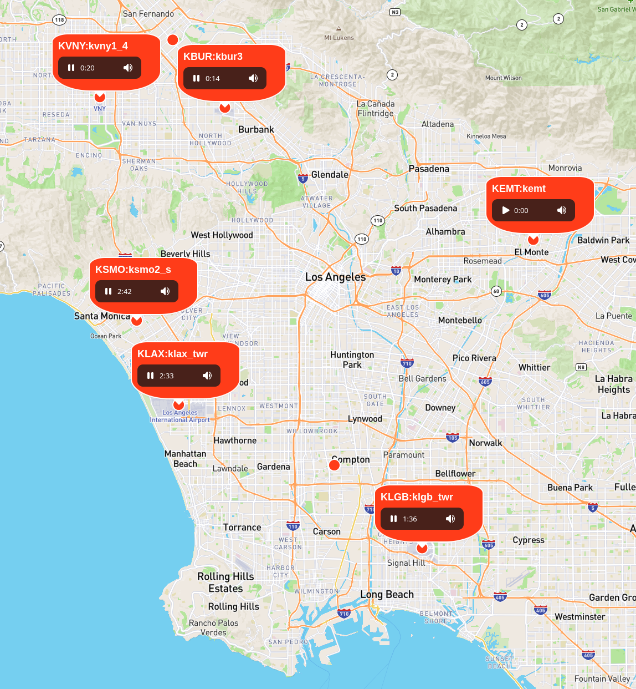

# demo-volatc



To run the demo...

```bash
git clone git@github.com:engelsjk/demo-volatc.git
```

In ```index.html```, replace ```MAPBOX_ACCESS_TOKEN``` with a valid Mapbox token. Then spin up a simple web server.

```bash
http-server
```

On the map, click an airport feed (red dot) to start streaming audio.

As you move the map around, the volume for a station will change depending on how far the station is from the center of the map (or turn off if it is out of view). Inspired by [this tweet](https://twitter.com/morganherlocker/status/1519905348995280898).

Finally, please be aware of this [information](https://www.liveatc.net/legal/).
